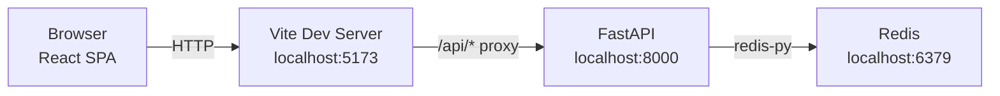
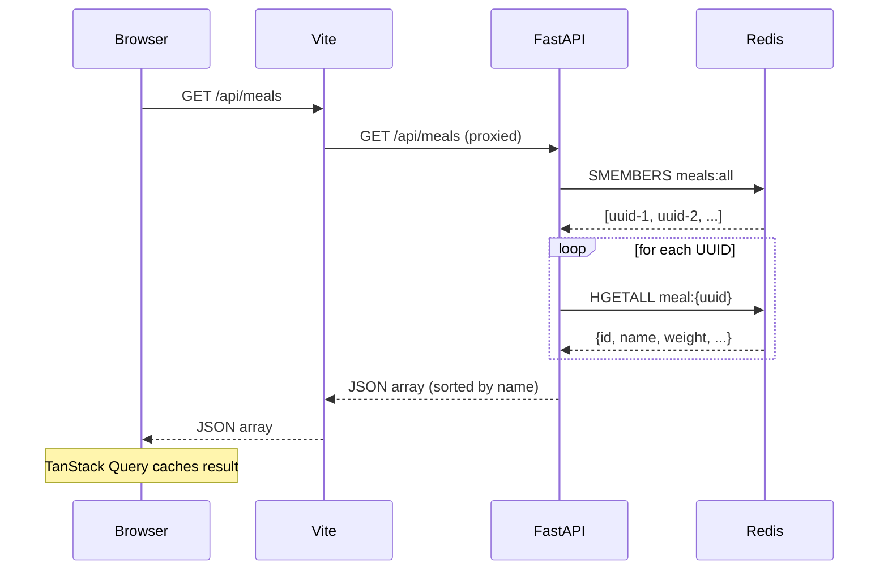
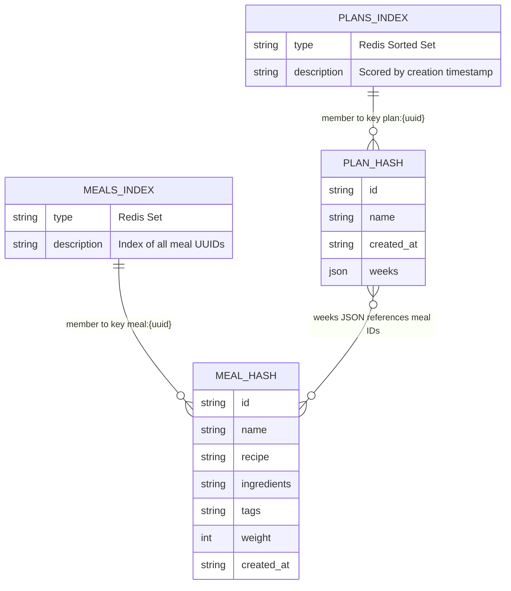
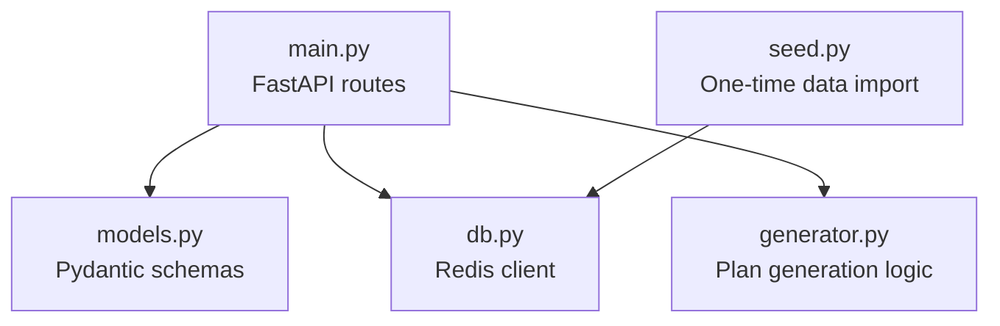
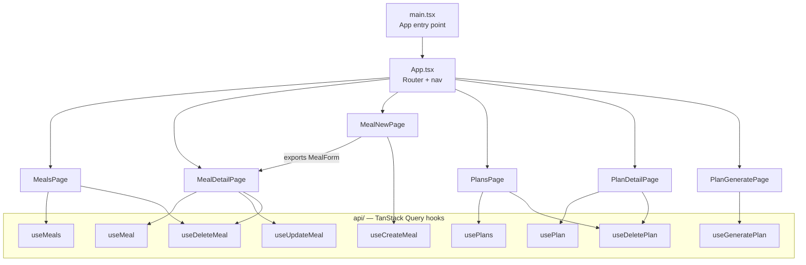
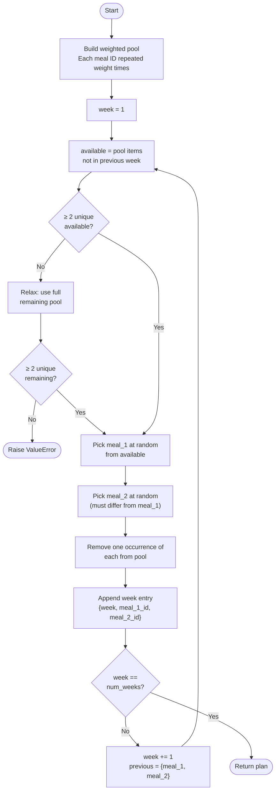

# Architecture

## System Overview

The app is a standard three-tier web application: a React SPA, a Python REST API, and Redis as the data store. In local development the Vite dev server proxies all `/api` requests to FastAPI, so the browser only ever talks to one origin.

---

## Request Flow

A typical data-fetch cycle from the browser's perspective:

---

## Data Model (Redis)

Redis key layout. There are no joins — plan weeks store meal IDs, and meal names are resolved by the API at read time.

**Key naming:**

| Key | Type | Purpose |
|---|---|---|
| `meal:{uuid}` | Hash | All fields for one meal |
| `meals:all` | Set | Index of all meal UUIDs |
| `plan:{uuid}` | Hash | All fields for one plan (weeks stored as JSON) |
| `plans:all` | Sorted Set | Index of all plan UUIDs, scored by creation time |

---

## Backend Structure

All modules are flat in `backend/`. No package structure — imports are direct.

---

## Frontend Structure

---

## Plan Generation Algorithm

**Key properties the algorithm guarantees:**
- No meal appears twice in the same week
- No meal carries over from the previous week (back-to-back constraint)
- Each meal is removed from the pool after selection — within a single run, a meal can only repeat if its `weight` is > 1
- Constraints are relaxed gracefully when the pool runs low, rather than failing silently
