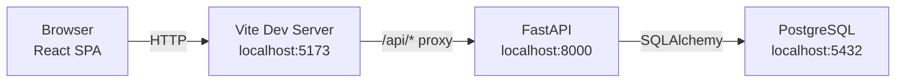
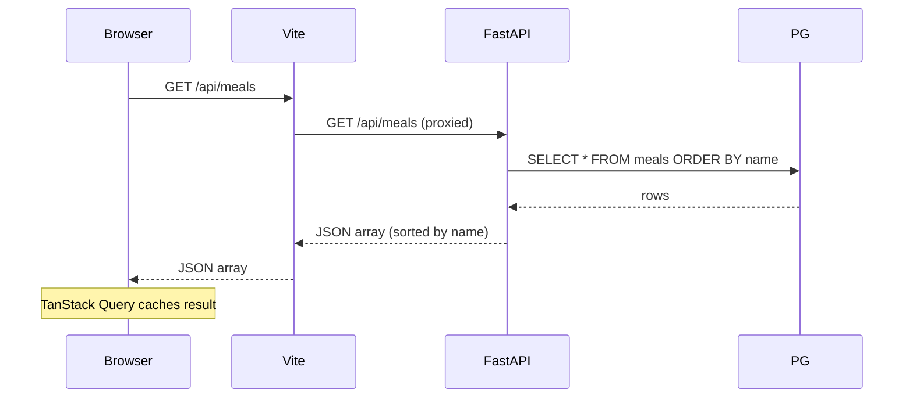
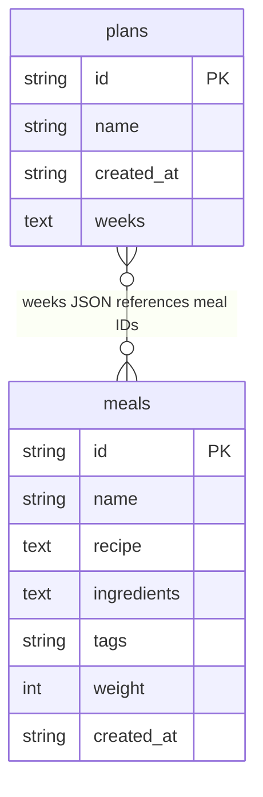
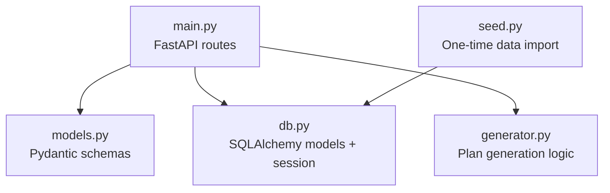
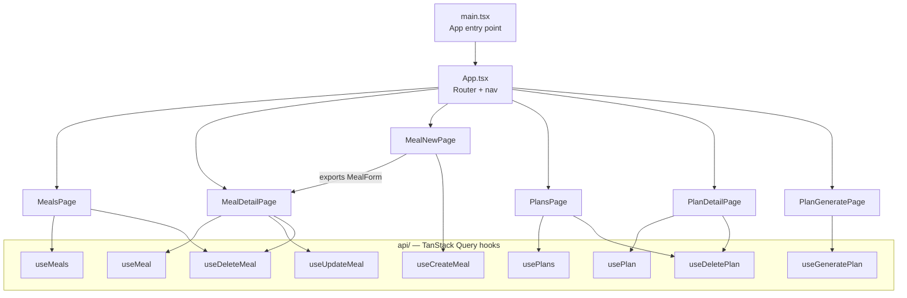

# Architecture

## System Overview

The app is a standard three-tier web application: a React SPA, a Python REST API, and PostgreSQL as the data store. In local development the Vite dev server proxies all `/api` requests to FastAPI, so the browser only ever talks to one origin.

---

## Request Flow

A typical data-fetch cycle from the browser's perspective:

---

## Data Model (PostgreSQL)

Two tables. Plan weeks are stored as a JSON column — no join table needed at this scale.

**Table notes:**

| Table | Notable columns |
|---|---|
| `meals` | `weight` 1–5 controls selection frequency; `tags` is a comma-separated string |
| `plans` | `weeks` stores a JSON array of `{week, meal_1_id, meal_2_id}`; meal names are resolved at read time |

---

## Backend Structure

All modules are flat in `backend/`. No package structure — imports are direct.

---

## Frontend Structure

---

## Plan Generation Algorithm

**Key properties the algorithm guarantees:**
- No meal appears twice in the same week
- No meal carries over from the previous week (back-to-back constraint)
- Each meal is removed from the pool after selection — within a single run, a meal can only repeat if its `weight` is > 1
- Constraints are relaxed gracefully when the pool runs low, rather than failing silently
